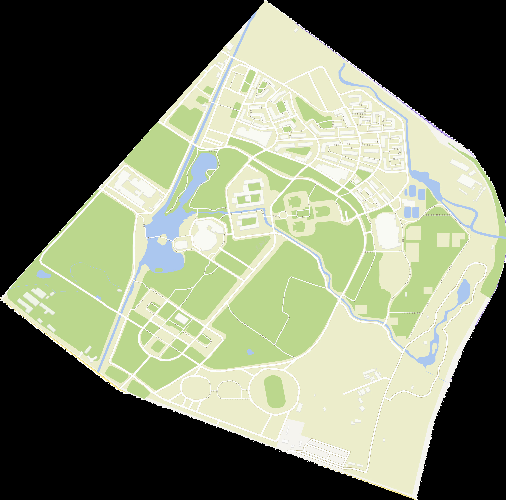
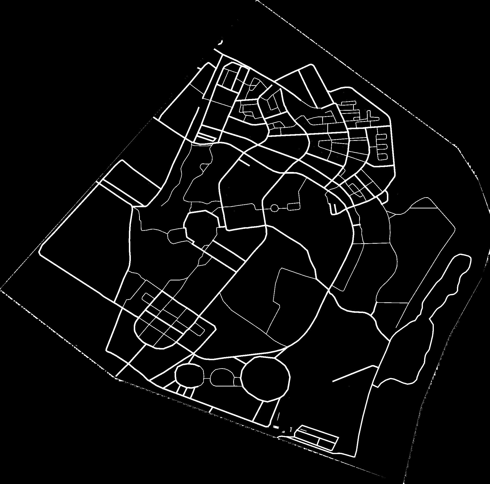
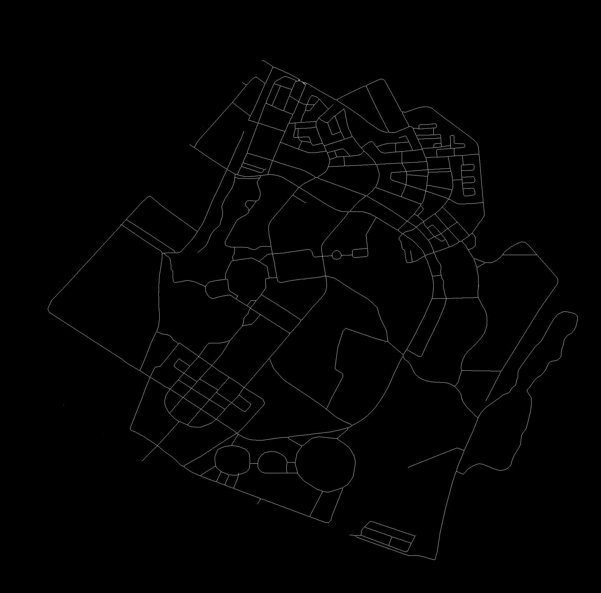
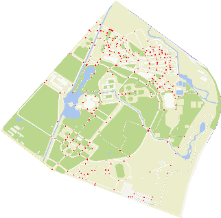
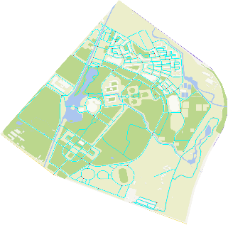

# 第一阶段介绍

## 目标

利用“水经注”提供的电子科技大学校园电子地图提取地图信息，完成所有节点与路径的提取。

## 方法

下面就是电子科技大学（清水河校区）的地图啦，为了避免周围白色影响识别效果，提前将它们涂成黑色。



那么如何让计算机识别出节点和路径呢？

可以看到，路径都呈现白色的特点，据此可以找出所有组成路径的像素。经过观察可以看出路径像素的RGB平均值大于250，基于此将所有路径像素筛选出来，变成白色，其余点都变成黑色，这样我们就能进行后续的操作了。二值化效果如下：



可是目前路径宽度不只一个像素，要怎样搜索出节点呢？可以使用skimage库里面的skeletonize函数完成框架提取，效果如下图。现在我们的所有路径都是单像素的啦。



下一步就可以完成节点的搜索了，容易发现节点都有这样的特征：以节点为圆心做一个合适大小的圆，则圆与路径的交点至少有3个。基于此做一次搜索，多次筛选就可以找到所有节点了。

找到的所有节点如图：



从每个节点使用DFS找到相邻节点即返回，据此可以找到所有相邻节点间的路径。他们如下图：



此时我们就已经完成第一阶段的工作啦~

## 代码

二值化、框架提取：skeletonget.py

```python
import cv2
from skimage import morphology
import numpy as np

img = cv2.imread('rawmapn.png', 0)   # 读取图片
_,binary = cv2.threshold(img, 250, 255, cv2.THRESH_BINARY)  # 二值化处理
cv2.imwrite("binary.png", binary)   # 保存二值化图片
binary[binary==255] = 1
skeleton0 = morphology.skeletonize(binary)   # 骨架提取
num = 0
x,y=skeleton0.shape
skeleton=np.zeros([x,y,3],np.int)

for i in range(len(skeleton0)):
    for j in range(len(skeleton0[i])):
        ele=skeleton0[i][j]
        for k in range(3):
            skeleton[i][j][k]=ele*255
print(skeleton)
#skeleton = skeleton0.astype(np.uint8)*255
cv2.imwrite("skeleton.png", skeleton)        # 保存骨架提取后的图片
```

调用的函数库：Mylib.py

```python
from PIL import Image
import numpy as np
from time import time
import matplotlib.pyplot as plt
import sys
from math import*

sys.setrecursionlimit(8000)

def readData(filename):                   #读取图片信息
    image_dir = filename
    x = Image.open(image_dir)  # 打开图片方式1
    #x = mpimg.imread(image_dir)  #打开图片方式2
    #x = Image.open(image_dir)    #打开图片方式2
    data = np.array(x)  # 转换为矩阵
    data.flags.writeable = True
    return data

def cor2str(i,j):
    return str(i)+','+str(j)

def str2cor(string):
    a=string.split(',')
    return (int(a[0]),int(a[1]))

def isBlack(alist):
    if alist[0]+alist[1]+alist[2]==0:
        return True
    else:
        return False

def isWhite(alist):
    if alist[0]==255 and alist[1]==255 and alist[2]==255:
        return True
    else:
        return False

def isKnot(cor_pixel,cor):
    x=cor[0]
    y=cor[1]
    sum=0
    if isWhite(cor_pixel[cor2str(x-1,y-1)]):
        sum+=1
    if isWhite(cor_pixel[cor2str(x-1,y)]):
        sum+=1
    if isWhite(cor_pixel[cor2str(x-1,y+1)]):
        sum+=1
    if isWhite(cor_pixel[cor2str(x,y-1)]):
        sum+=1
    if isWhite(cor_pixel[cor2str(x,y+1)]):
        sum+=1
    if isWhite(cor_pixel[cor2str(x+1,y-1)]):
        sum+=1
    if isWhite(cor_pixel[cor2str(x+1,y)]):
        sum+=1
    if isWhite(cor_pixel[cor2str(x+1,y+1)]):
        sum+=1
    if sum>=3 or sum==1: #阈值
        return True
    else:
        return False

def whitePointGet(data,cor_pixel):
    white_cor = []  # 白像素坐标
    length = len(data)
    wide = len(data[0])
    print(1)
    for i in range(length):
        for j in range(wide):
            cor_pixel[cor2str(i, j)] = data[i][j]  # 键值对生成
            if isWhite(data[i][j]):
                white_cor.append([i, j])  # 白像素提取
    print(2)
    return white_cor

def knotGet(data,white_cor,cor_pixel):
    knot = []  # 节点
    length = len(data)
    wide = len(data[0])
    for i in white_cor:
        if i[0] == 0 or i[0] == length - 1 or i[1] == 0 or i[1] == wide - 1:
            continue
        else:
            if isKnot(cor_pixel, i):
                knot.append(i)
    print(3)
    knotnew=filter(knot)
    while knotnew!=knot:
        knot=knotnew
        knotnew=filter(knot)
    return knotnew

def filter(knot):
    knotnew = []  # 筛选后节点
    visit = []
    for i in range(len(knot)):
        if (i in visit):
            continue
        nearpoints = []
        for j in range(i + 1, len(knot)):
            if (dist(knot[i], knot[j]) <= 2):
                nearpoints.append(knot[j])
                visit.append(j)
        l = len(nearpoints)
        if l == 0:
            knotnew.append(knot[i])
        else:
            xsum = knot[i][0] + sum([i[0] for i in nearpoints])
            ysum = knot[i][1] + sum([i[1] for i in nearpoints])
            knotnew.append([round(xsum / (l + 1)), round(ysum / (l + 1))])
    return knotnew

def LM(data):
    length=len(data)
    wide=len(data[0])
    return [[0 for i in range(wide)] for i in range(length)]

def search(scor,cor,LableMatrix,distMat,cor_color):
    length=len(LableMatrix)
    wide=len(LableMatrix[0])
    #print(cor)
    x=cor[0]
    y=cor[1]
    if LableMatrix[x][y] == 1 or dist(scor,cor)>500:  #限定搜索范围
        return 0
    keys=cor_color.keys()
    LableMatrix[x][y]=1
    road=[]
    if cor_color[cor2str(x,y)]==1:
        print('Got it!')
        return [[cor]]
    else:
        flag=0
        #pre condition judge
        if x!=0 and (cor2str(x-1,y) in keys) and LableMatrix[x-1][y]==0 and cor_color[cor2str(x-1,y)]==1:
            LableMatrix[x - 1][y] = 1
            return [[cor,[x-1,y]]]
        if x!=0 and (cor2str(x,y-1) in keys) and LableMatrix[x][y-1]==0 and cor_color[cor2str(x,y-1)]==1:
            LableMatrix[x][y-1] = 1
            return [[cor,[x,y-1]]]
        if x!=0 and (cor2str(x+1,y) in keys) and LableMatrix[x+1][y]==0 and cor_color[cor2str(x+1,y)]==1:
            LableMatrix[x + 1][y] = 1
            return [[cor,[x+1,y]]]
        if x!=0 and (cor2str(x,y+1) in keys) and LableMatrix[x][y+1]==0 and cor_color[cor2str(x,y+1)]==1:
            LableMatrix[x][y+1] = 1
            return [[cor,[x,y+1]]]
        if x!=0 and (cor2str(x-1,y-1) in keys) and LableMatrix[x-1][y-1]==0 and cor_color[cor2str(x-1,y-1)]==1:
            LableMatrix[x - 1][y-1] = 1
            return [[cor,[x-1,y-1]]]
        if x!=0 and (cor2str(x-1,y+1) in keys) and LableMatrix[x-1][y+1]==0 and cor_color[cor2str(x-1,y+1)]==1:
            LableMatrix[x - 1][y+1] = 1
            return [[cor,[x-1,y+1]]]
        if x!=0 and (cor2str(x+1,y-1) in keys) and LableMatrix[x+1][y-1]==0 and cor_color[cor2str(x+1,y-1)]==1:
            LableMatrix[x+1][y-1] = 1
            return [[cor,[x+1,y-1]]]
        if x!=0 and (cor2str(x+1,y+1) in keys) and LableMatrix[x+1][y+1]==0 and cor_color[cor2str(x+1,y+1)]==1:
            LableMatrix[x+1][y+1] = 1
            return [[cor,[x+1,y+1]]]
        if x!=0 and (cor2str(x-1,y) in keys) and LableMatrix[x-1][y]==0:
            #LableMatrix[x-1][y] = 1
            flag=1
            p=search(scor,[x-1,y], LableMatrix, distMat, cor_color)
            if p!=0:
                for i in range(len(p)):
                    roadt=[cor]
                    for j in p[i]:
                        roadt.append(j)
                    road.append(roadt)
        if y!=0 and (cor2str(x,y-1) in keys) and LableMatrix[x][y-1]==0:
            #LableMatrix[x][y-1] = 1
            flag = 1
            p=search(scor,[x,y-1], LableMatrix, distMat, cor_color)
            if p!=0:
                for i in range(len(p)):
                    roadt=[cor]
                    for j in p[i]:
                        roadt.append(j)
                    road.append(roadt)

        if x!=length-1 and (cor2str(x+1,y) in keys) and LableMatrix[x+1][y]==0:
            #LableMatrix[x+1][y] = 1
            flag = 1
            p=search(scor,[x+1,y], LableMatrix, distMat, cor_color)
            if p!=0:
                for i in range(len(p)):
                    roadt=[cor]
                    for j in p[i]:
                        roadt.append(j)
                    road.append(roadt)
        if y!=wide-1 and (cor2str(x,y+1) in keys) and LableMatrix[x][y+1]==0:
            #cor_color[cor2str(x,y+1)]==0
            #LableMatrix[x][y+1] = 1
            flag = 1
            p=search(scor,[x,y+1], LableMatrix, distMat, cor_color)
            if p!=0:
                for i in range(len(p)):
                    roadt=[cor]
                    for j in p[i]:
                        roadt.append(j)
                    road.append(roadt)
        if x!=0 and y!=0 and (cor2str(x-1,y-1) in keys) and LableMatrix[x-1][y-1]==0:
            #LableMatrix[x-1][y - 1] = 1
            flag = 1
            p=search(scor,[x-1,y-1], LableMatrix, distMat, cor_color)
            if p != 0:
                for i in range(len(p)):
                    roadt = [cor]
                    for j in p[i]:
                        roadt.append(j)
                    road.append(roadt)
        if x!=length-1 and y!=0 and (cor2str(x+1,y-1) in keys) and LableMatrix[x+1][y-1]==0:
            #LableMatrix[x+1][y - 1] = 1
            flag = 1
            p=search(scor,[x+1,y-1], LableMatrix, distMat, cor_color)
            if p != 0:
                for i in range(len(p)):
                    roadt = [cor]
                    for j in p[i]:
                        roadt.append(j)
                    road.append(roadt)
        if x!=0 and y!=wide-1 and (cor2str(x-1,y+1) in keys) and LableMatrix[x-1][y+1]==0:
            #LableMatrix[x-1][y + 1] = 1
            flag = 1
            p=search(scor,[x-1,y+1], LableMatrix, distMat, cor_color)
            if p != 0:
                for i in range(len(p)):
                    roadt = [cor]
                    for j in p[i]:
                        roadt.append(j)
                    road.append(roadt)
        if x!=length-1 and y!=wide-1 and (cor2str(x+1,y+1) in keys) and LableMatrix[x+1][y+1]==0:
            #LableMatrix[x+1][y + 1] = 1
            flag = 1
            p=search(scor,[x+1,y+1], LableMatrix, distMat, cor_color)
            if p != 0:
                for i in range(len(p)):
                    roadt = [cor]
                    for j in p[i]:
                        roadt.append(j)
                    road.append(roadt)
        if flag==0:
            return 0
        else:
            return road

def distance(aList):
    l=len(aList)
    dis=0
    for i in range(l-1):
        dis+=dist(aList[i],aList[i+1])
    return dis

def distanceAdd(data,knotnew,knot_cor_id,distMat,knotRoad,cor_color_ori):
    l=len(knotnew)
    allEdge = []
    for i in range(l):
        print(i)
        LableMatrix = LM(data)
        start=knotnew[i]
        cor_color=cor_color_ori.copy()
        cor_color[cor2str(start[0], start[1])] = 2
        road = search(start, start, LableMatrix, distMat, cor_color)
        for j in road:
            allEdge.append(j)
            s=j[0]
            e=j[-1]
            a=knot_cor_id[cor2str(s[0],s[1])]
            b=knot_cor_id[cor2str(e[0],e[1])]
            dis=distance(j)
            if(dis<distMat[a][b]):
                distMat[a][b] = dis
                distMat[b][a] = dis
                knotRoad[cor2str(a, b)] = j
                jr=j.copy()
                jr.reverse()
                knotRoad[cor2str(b, a)] = jr
            '''
            for k in j:
                print(k)
            x = j[-1][0]
            y = j[-1][1]
            dddata[x][y][0] = 0
            dddata[x][y][1] = 0
            dddata[x][y][2] = 255
        print(type(road))
            '''
    return allEdge

def writedata(file1,file2,file3,file4,distMat,knotRoad,knot_cor_id,allEdge):
    #距离矩阵写入文件
    f = open(file1,'w', encoding="utf-8")
    k=0
    for i in distMat:
        l = len(i)
        string = str(i[0])
        for j in range(0, l - 1):
            string += ' '
            string += str(i[j + 1])
        string += '\n'
        print(k)
        f.write(string)
        k+=1
    f.close()

    #路径写入文件
    f = open(file2, 'w', encoding="utf-8")
    for i in knotRoad.values():
        l = len(i)
        string = str(i[0][0])+','+str(i[0][1])
        for j in range(0, l - 1):
            string += ' '
            string += str(i[j + 1][0])+','+str(i[j + 1][1])
        string += '\n'
        f.write(string)
    f.close()

    #节点坐标——序号 写入文件
    f = open(file3, 'w', encoding="utf-8")
    for i in knot_cor_id.keys():
        string = i
        string += ','+str(knot_cor_id[i])+'\n'
        f.write(string)
    f.close()

    #边 写入文件
    f = open(file4, 'w', encoding="utf-8")
    for i in allEdge:
        l = len(i)
        string = str(i[0][0])+','+str(i[0][1])
        for j in range(0, l - 1):
            string += ' '
            string += str(i[j + 1][0])+','+str(i[j + 1][1])
        string += '\n'
        f.write(string)
    f.close()
```

主程序：InfoGet.py

```python
from MyLib import*

if __name__=='__main__':
    t1=time()
    print(1)
    #1数据读入
    data = readData('skeleton.png')
    data = np.array(data)
    cor_pixel = dict()  # 坐标——像素
    t2=time()

    #2白色像素提取
    white_cor = whitePointGet(data,cor_pixel)
    t3=time()

    #3节点提取
    knotnew=knotGet(data,white_cor,cor_pixel)
    plt.scatter([i[0] for i in knotnew],[i[1] for i in knotnew])
    #plt.show()
    t4=time()

    #4节点标记
    for i in knotnew:         #节点标记为红色
        data[i[0]][i[1]][1] = 0
        data[i[0]][i[1]][2] = 0
    #image = Image.fromarray(data)  # 将之前的矩阵转换为图片

    dddata=data               #用于可视化以调试
    #image.show()            #调用本地软件显示图片，win10是叫照片的工具

    #5节点间长度计算
    knot_cor_id=dict()           #节点 坐标——序号
    l=len(knotnew)
    for i in range(l):
        knot_cor_id[cor2str(knotnew[i][0],knotnew[i][1])]=i

    cor_color=dict()             #坐标——颜色(白色：0，红色：1，开始搜寻点：2)
    for i in white_cor:#白色
        cor_color[cor2str(i[0],i[1])]=0
    for i in knotnew:#红色
        cor_color[cor2str(i[0],i[1])]=1

    print(4)
    distMat=[[len(data)*len(data[0]) for i in range(l)] for i in range(l)]
    for i in range(l):
        distMat[i][i]=0
    knotRoad=dict()
    allEdge=distanceAdd(data,knotnew,knot_cor_id,distMat,knotRoad,cor_color)
    print(len(distMat),len(distMat[0]))
    image = Image.fromarray(dddata)  # 将之前的矩阵转换为图片
    image.show()            #调用本地软件显示图片，win10是叫照片的工具

    file1='E:\\Jerry\\My University\\大学\\课程\\第四学期\\创业实训\\算法\\最终\\第二阶段——图论算法\\distMat.txt'
    file2='E:\\Jerry\\My University\\大学\\课程\\第四学期\\创业实训\\算法\\最终\\第二阶段——图论算法\\knotRoad.txt'
    file3='E:\\Jerry\\My University\\大学\\课程\\第四学期\\创业实训\\算法\\最终\\第二阶段——图论算法\\knot_cor_id.txt'
    file4 = 'E:\\Jerry\\My University\\大学\\课程\\第四学期\\创业实训\\算法\\最终\\第二阶段——图论算法\\allEdge.txt'
    writedata(file1, file2, file3,file4, distMat, knotRoad, knot_cor_id,allEdge)

    file5='E:\\Jerry\\My University\\大学\\课程\\第四学期\\创业实训\\算法\\最终\\第三阶段——用户控制\\distMat.txt'
    file6='E:\\Jerry\\My University\\大学\\课程\\第四学期\\创业实训\\算法\\最终\\第三阶段——用户控制\\knotRoad.txt'
    file7='E:\\Jerry\\My University\\大学\\课程\\第四学期\\创业实训\\算法\\最终\\第三阶段——用户控制\\knot_cor_id.txt'
    file8 = 'E:\\Jerry\\My University\\大学\\课程\\第四学期\\创业实训\\算法\\最终\\第三阶段——用户控制\\allEdge.txt'
    writedata(file5, file6, file7,file8, distMat, knotRoad, knot_cor_id,allEdge)
    t5 = time()

    '''
    for i in road:
        print(i)
        x=[j[0] for j in i]
        y=[j[1] for j in i]
        plt.scatter(x,y)
        plt.show()'''
    # 图形导出
    #cv2.imwrite('2.jpg',data)
    #data2 = readData('2.jpg')

    print(t2-t1,t3-t2,t4-t3,t5-t4)
```