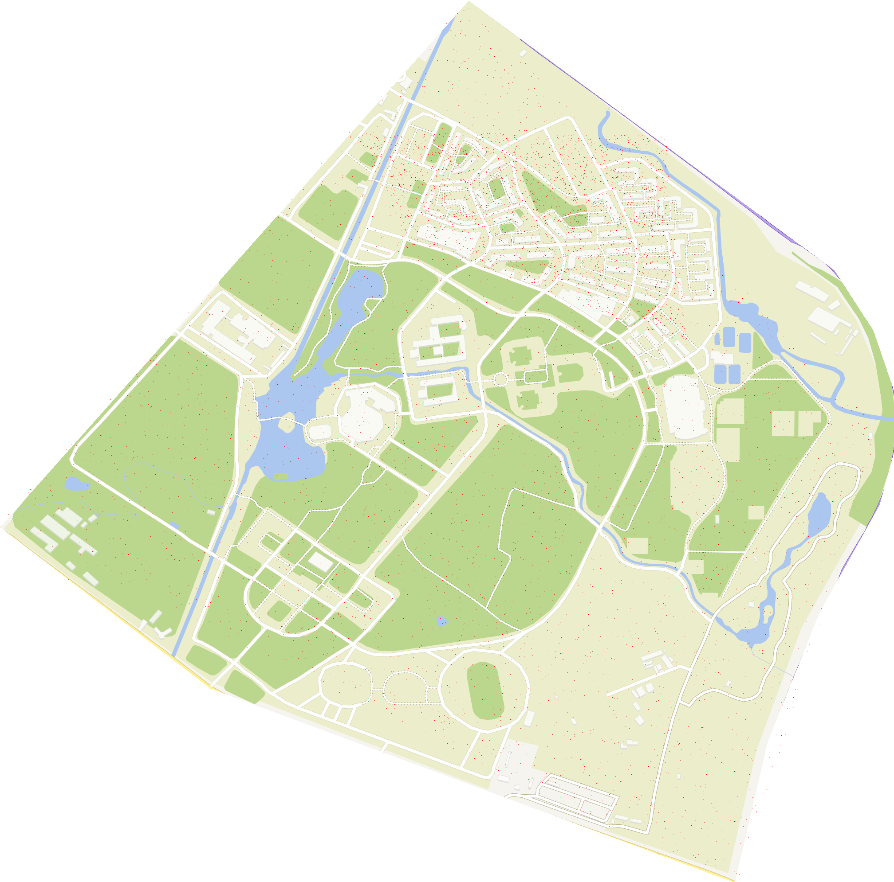
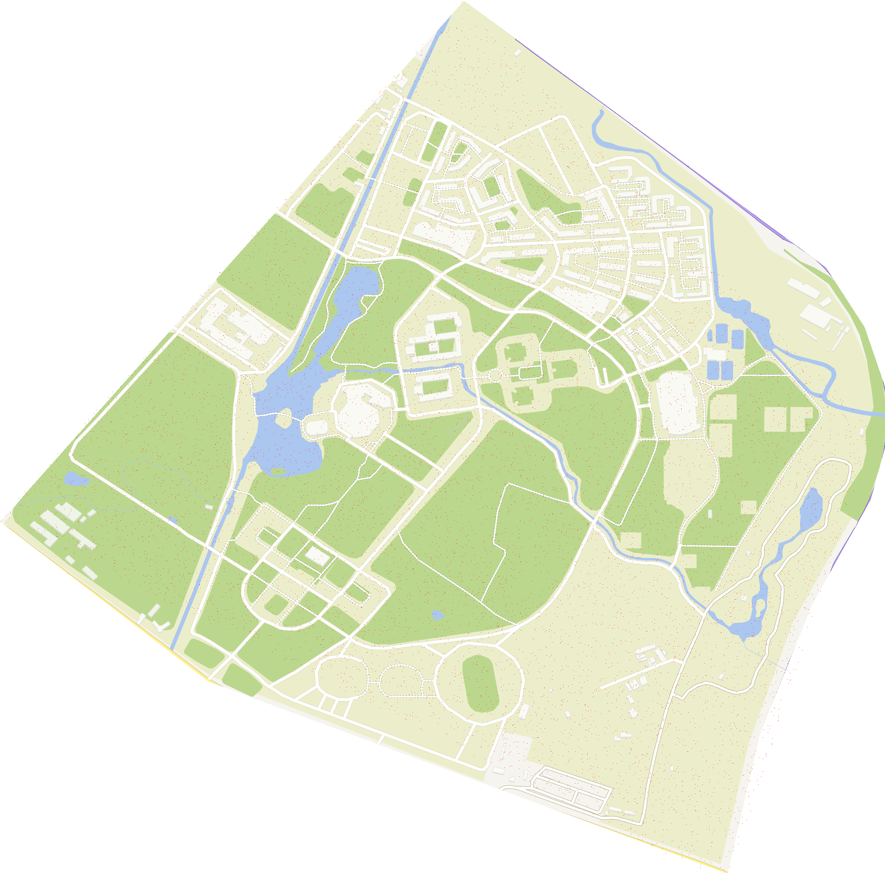
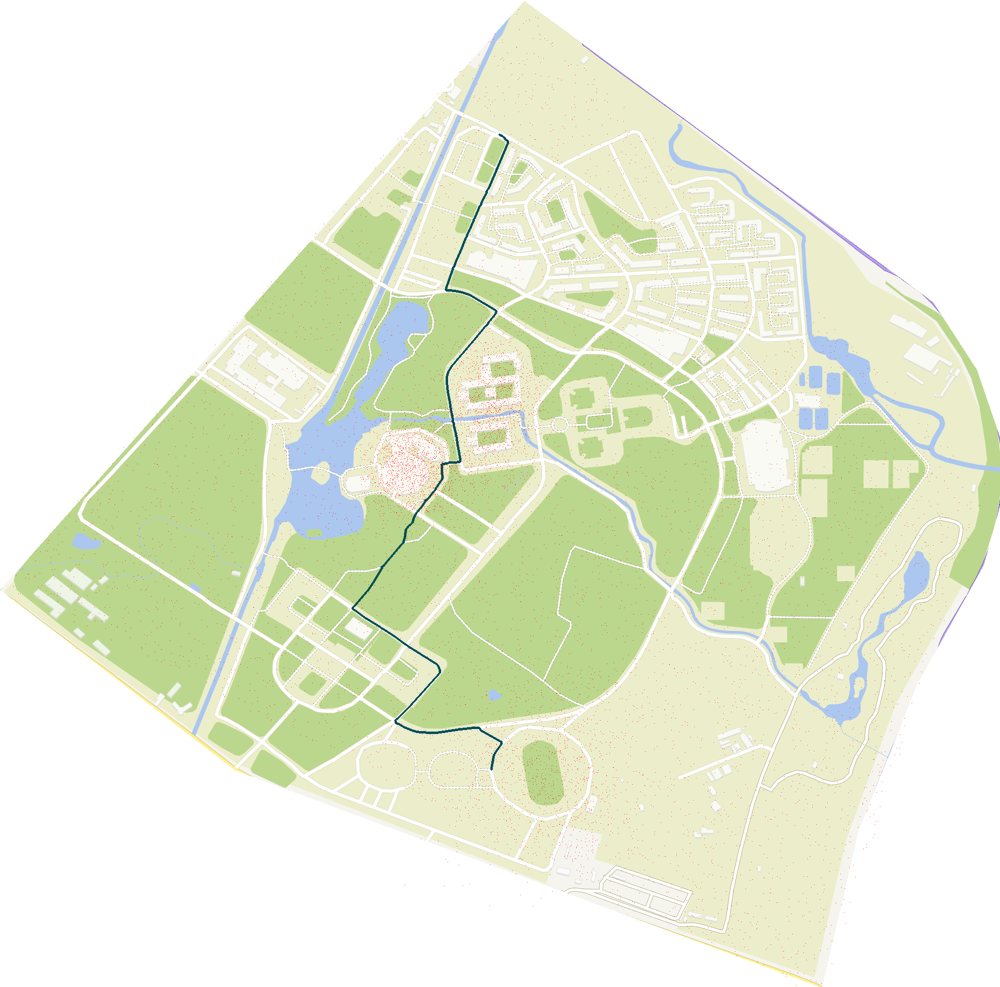

# 第三阶段介绍

## 目标

针对不同的用户画像、不同时间段的人流情况为每位用户推荐最佳的路径。

## 方法

### 用户画像

|    类型    |                             特点                             |
| :--------: | :----------------------------------------------------------: |
| 拥挤厌恶型 |     此类用户对拥挤十分敏感，应当尽可能为其避免拥挤区域。     |
| 拥挤中立型 | 此类用户对拥挤不敏感，追求路径最短。 大多数用户都属于这种类型。 |
| 拥挤喜好型 | 一些用户，在一定情况下会更青睐拥挤的道路，如夜晚独自回寝室的学生。 |

目前将用户分为三类，其实更多不同类型的用户只体现在参数的变化。

### 人流情况

目前模拟了4种人流情况，分别是早8，中午13点，晚9，和均匀分布，如下图。







以上效果使用随机投点生成。撒点后对路径进行一次搜索，得到每条路上有多少人流，作为新的边的权重，生成第二个矩阵。第一个矩阵记录了每相邻节点间的距离。将两个矩阵以一定系数相加就得到了新的矩阵，系数的选择体现了用户的喜好，从起点开始使用Dijkstra算法即可得到针对特定用户的最优路径。

## 测试

话不多说，咱们来测试一下吧~

### 对比Ⅰ

以体育馆到商业街为例，拥挤喜好型会选择这样的路径：

**组团_体育馆(8点)**

.PNG)

**组团_体育馆(13点)**

.PNG)

**组团_体育馆(21点)**

.PNG)

**组团_体育馆(随机)**

.PNG)

其他两种类型在不同时间点的路径选择就不一一展示了，可以在**相关图片->阶段三**找到。

### 对比Ⅱ

我们再来对比一下同一时刻不同用户的选择吧~

以体育馆到商业街为例，21点时不同用户会选择这样的路径：

**拥挤厌恶型**

-1623424796115.PNG)

**拥挤中立型**



**拥挤喜好型**

-1623424808600.PNG)

## 代码

人流模式生成：diffModeGet.py

```python
from MyLib import*
t1=time()
knot_cor_id=open_KCI()
knotRoad=open_knotRoad(knot_cor_id)
allPath=open_path(knot_cor_id)
knot_id_cor=id2cor(knot_cor_id)

data = readData('rawmapn.tif')
data = np.array(data)
length=len(data)
wide=len(data[0])

print(0)
mode=0
points=randPeopleStream(data,mode,length,wide)
l=len(knot_id_cor)
distMat=[[len(data)*len(data[0]) for i in range(l)] for i in range(l)]
streamMat=[[0 for i in range(l)] for i in range(l)]
for i in allPath.keys():
    cor=str2cor(i)
    x=cor[0]
    y=cor[1]
    stream=weigthAdd(allPath[i],points)
    print(stream)
    distMat[x][y]=distance(allPath[i])
    streamMat[x][y]=stream
writeData('distMat.txt',distMat)
writeData('streamMat0.txt',streamMat)
writeData('points0.txt',points)

print(1)
mode=1
points=randPeopleStream(data,mode,length,wide)
l=len(knot_id_cor)
streamMat=[[0 for i in range(l)] for i in range(l)]
for i in allPath.keys():
    cor=str2cor(i)
    x=cor[0]
    y=cor[1]
    stream=weigthAdd(allPath[i],points)
    print(stream)
    streamMat[x][y]=stream
writeData('streamMat1.txt',streamMat)
writeData('points1.txt',points)

print(2)
mode=2
points=randPeopleStream(data,mode,length,wide)
l=len(knot_id_cor)
streamMat=[[0 for i in range(l)] for i in range(l)]
for i in allPath.keys():
    cor=str2cor(i)
    x=cor[0]
    y=cor[1]
    stream=weigthAdd(allPath[i],points)
    print(stream)
    streamMat[x][y]=stream
writeData('streamMat2.txt',streamMat)
writeData('points2.txt',points)

print(3)
mode=3
points=randPeopleStream(data,mode,length,wide)
l=len(knot_id_cor)
streamMat=[[0 for i in range(l)] for i in range(l)]
for i in allPath.keys():
    cor=str2cor(i)
    x=cor[0]
    y=cor[1]
    stream=weigthAdd(allPath[i],points)
    print(stream)
    streamMat[x][y]=stream
writeData('streamMat3.txt',streamMat)
writeData('points3.txt',points)

t7=time()
print(t7-t1)

#colorChange(data, 980, 1990, 30, 0, 255, 255)
image = Image.fromarray(data)  # 将之前的矩阵转换为图片
image.show()  # 调用本地软件显示图片，win10是叫照片的工具
```

调用的函数库：MyLib.py

```python
from time import*
from random import *
from math import*
from PIL import Image
import numpy as np
from copy import *
epsilon=0.001
def readData(filename):                   #读取图片信息
    image_dir = filename
    x = Image.open(image_dir)  # 打开图片方式1
    #x = mpimg.imread(image_dir)  #打开图片方式2
    #x = Image.open(image_dir)    #打开图片方式2
    data = np.array(x)  # 转换为矩阵
    data.flags.writeable = True
    return data

def cor2str(i,j):
    return str(i)+','+str(j)

def str2cor(string):
    a=string.split(',')
    return (int(a[0]),int(a[1]))

def openFloyd():
    with open('floyd.txt', 'r', encoding='utf-8') as f:
        road = dict()
        for line in f:
            roadi = line.strip().split(' ')
            road[cor2str(roadi[0], roadi[-1])] = [int(i) for i in roadi]
    f.close()
    return road

def open_path(knot_cor_id):
    with open('allEdge.txt', 'r', encoding='utf-8') as f:
        allPath = dict()
        for line in f:
            road = line.strip().split(' ')
            a = knot_cor_id[road[0]]
            b = knot_cor_id[road[-1]]
            allPath[cor2str(a, b)] = [[j for j in str2cor(i)] for i in road]
    f.close()
    return allPath

def open_distMat(filename):
    with open(filename, 'r', encoding='utf-8') as f:
        distMat=[]
        for line in f:
            distMati = line.strip().split(' ')
            distMat.append([float(i) for i in distMati])
    f.close()
    return distMat

def open_KCI():
    with open('knot_cor_id.txt', 'r', encoding='utf-8') as f:
        knot_cor_id = dict()
        for line in f:
            cor_id = line.strip().split(',')
            knot_cor_id[cor_id[0] + ',' + cor_id[1]] = int(cor_id[2])
    f.close()
    return knot_cor_id

def open_knotRoad(knot_cor_id):
    with open('knotRoad.txt', 'r', encoding='utf-8') as f:
        knotRoad = dict()
        for line in f:
            road = line.strip().split(' ')
            a = knot_cor_id[road[0]]
            b = knot_cor_id[road[-1]]
            knotRoad[cor2str(a, b)] = [[j for j in str2cor(i)] for i in road]
    f.close()
    return knotRoad

def id2cor(knot_cor_id):
    knot_id_cor=dict()
    for i in knot_cor_id.keys():
        knot_id_cor[knot_cor_id[i]]=[j for j in str2cor(i)]
    return knot_id_cor

def colorChange(data,x,y,R,r,g,b):
    R=round(R)
    length=len(data)
    wide=len(data[0])
    p_candi=[]
    for i in range(-R,R+1):
        for j in range(-R,R+1):
            if x+i>=0 and x+i<length and y+j>=0 and y+j<wide:
                if dist([x+i,y+j],[x,y])<=R:
                    p_candi.append([x+i,y+j])
    for i in p_candi:
        x=i[0]
        y=i[1]
        data[x][y][0] = r
        data[x][y][1] = g
        data[x][y][2] = b

def dijkstra(distmat,a):
    distMat=deepcopy(distmat)
    maxdis = max([max(b) for b in distMat])
    road=dict()
    l=len(distMat)
    visit=set()
    visit.add(a)
    unvisit=set()
    for i in range(l):
        if distMat[a][i]==0:
            road[i]=[i]
            continue
        if distMat[a][i]!=maxdis:
            road[i]=[a,i]
    for i in range(l):
        if i==a:
            continue
        unvisit.add(i)
    while len(unvisit)!=0:
        uv=list(unvisit)
        id=uv[0]
        minimum=distMat[a][id]
        for i in uv:
            if distMat[a][i]<minimum-epsilon:
                minimum=distMat[a][i]
                id=i
        if a==276:
            print(id)
        visit.add(id)
        unvisit.remove(id)
        uv=list(unvisit)
        for i in uv:
            if distMat[a][id]+distMat[id][i]<distMat[a][i]-epsilon:
                distMat[a][i] = distMat[a][id] + distMat[id][i]
                distMat[i][a] = distMat[a][id] + distMat[id][i]
                roadid=road[id].copy()
                roadid.append(i)
                road[i]=roadid
    return road

def dijkstra2(distmat,a):
    distMat=deepcopy(distmat)
    maxdis = max([max(b) for b in distMat])
    road=dict()
    l=len(distMat)
    visit=set()
    visit.add(a)
    unvisit=set()
    for i in range(l):
        if distMat[a][i]==0:
            road[i]=[i]
            continue
        if distMat[a][i]!=maxdis:
            road[i]=[a,i]
    for i in range(l):
        if i==a:
            continue
        unvisit.add(i)
    while len(unvisit)!=0:
        uv=list(unvisit)
        id=uv[0]
        minimum=distMat[a][id]
        for i in uv:
            if distMat[a][i]<minimum-epsilon:
                minimum=distMat[a][i]
                id=i
        if a==276:
            print(id)
        visit.add(id)
        unvisit.remove(id)
        uv=list(unvisit)
        for i in uv:
            if distMat[a][id]+distMat[id][i]<distMat[a][i]-epsilon:
                distMat[a][i] = distMat[a][id] + distMat[id][i]
                distMat[i][a] = distMat[a][id] + distMat[id][i]
                roadid=road[id].copy()
                roadid.append(i)
                road[i] = roadid
    Road=dict()
    for key in road.keys():
        Road[cor2str(a,key)]=road[key]
    return Road

def openPoints(filename):
    with open(filename, 'r', encoding='utf-8') as f:
        distMat=[]
        for line in f:
            distMati = line.strip().split(' ')
            distMat.append([float(i) for i in distMati])
    f.close()
    return distMat

def writeData(filename,distMat):
    f = open(filename, 'w', encoding="utf-8")
    for i in distMat:
        l = len(i)
        string = str(i[0])
        for j in range(0, l - 1):
            string += ' '
            string += str(i[j + 1])
        string += '\n'
        f.write(string)
    f.close()

def pathShow(data,knot_id_cor,road,knotRoad,a,b):
    abpath = road[cor2str(a, b)]
    print(abpath)
    for i in range(len(abpath) - 1):
        s = abpath[i]
        e = abpath[i + 1]
        se_road = knotRoad[cor2str(s, e)]
        for j in range(1, len(se_road) - 1):
            x = se_road[j][0]
            y = se_road[j][1]
            colorChange(data, x, y, 2, 0, 80, 80)

    for i in range(len(abpath) - 1):
        s = abpath[i]
        e = abpath[i + 1]
        cor_s = knot_id_cor[s]
        cor_e = knot_id_cor[e]
        xs = cor_s[0]
        ys = cor_s[1]
        xe = cor_e[0]
        ye = cor_e[1]
        colorChange(data, xs, ys, 0, 0, 0, 255)
        if i == len(abpath) - 2:
            colorChange(data, xe, ye, 0, 0, 0, 255)
    '''
    image = Image.fromarray(data)  # 将之前的矩阵转换为图片
    image.show()  # 调用本地软件显示图片，win10是叫照片的工具
'''

def distance(aList):
    l=len(aList)
    dis=0
    for i in range(l-1):
        dis+=dist(aList[i],aList[i+1])
    return dis

def nearPointFind(x,y,knot_cor_id):
    keys=list(knot_cor_id.keys())
    point = str2cor(keys[0])
    distance=dist([x,y],point)
    nearest=point
    for key in range(1,len(keys)):
        point = str2cor(keys[key])
        if dist([x, y], point)<distance:
            distance=dist([x, y], point)
            nearest=point
    return nearest

def randPeopleStream(data,mode,length,wide):
    if mode==0:
        print('此模式模拟了早上8点的人流分布')
        #这时人流主要分布在宿舍区、品学楼、立人楼及之间的路上
        sum=0
        points = []
        while sum < 2000:
            x = randint(0, length)
            y = randint(0, wide)
            p1 = [300, 800]
            p2 = [538, 920]
            p3 = [780, 1450]
            p4 = [300, 1500]
            if isinQuar(p1, p2, p3, p4, [x, y]) and ([x, y] not in points):
                points.append([x, y])
                colorChange(data, x, y, 0, 255, 10, 0)
                sum += 1
        sum = 0
        while sum < 1500:
            x = int(np.random.normal(loc=850, scale=80))  # 生成随机正态分布数。
            y = int(np.random.normal(loc=1200, scale=80))
            if [x, y] not in points:
                points.append([x, y])
                sum += 1
        sum=0
        while sum < 1500:
            x = int(np.random.normal(loc=1200, scale=100))  # 生成随机正态分布数。
            y = int(np.random.normal(loc=1160, scale=100))
            if [x, y] not in points:
                points.append([x, y])
                sum += 1
        sum = 0
        while sum<5000:
            x=randint(0,length)
            y=randint(0,wide)
            p1=[0,1050]
            p2=[1180,0]
            p3=[2015,1655]
            p4=[980,1990]
            if isinQuar(p1,p2,p3,p4,[x,y]) and ([x,y] not in points):
                points.append([x,y])
                sum+=1
        return points


    if mode==1:
        print('此模式模拟了中午13点的人流分布')
        #这时人流主要分布在宿舍区
        sum = 0
        points = []
        while sum < 4000:
            x = randint(0, length)
            y = randint(0, wide)
            p1 = [300, 800]
            p2 = [538, 920]
            p3 = [780, 1550]
            p4 = [300, 1500]
            if isinQuar(p1, p2, p3, p4, [x, y]) and ([x, y] not in points):
                points.append([x, y])
                colorChange(data, x, y, 0, 255, 10, 0)
                sum += 1
        sum=0
        while sum<6000:
            x=randint(0,length)
            y=randint(0,wide)
            p1=[0,1050]
            p2=[1180,0]
            p3=[2015,1655]
            p4=[980,1990]
            if isinQuar(p1,p2,p3,p4,[x,y]) and ([x,y] not in points):
                points.append([x,y])
                sum+=1
        return points

    if mode==2:
        print('此模式模拟了晚上9点的人流分布')
        # 这时人流主要分布在科研楼、图书馆、体育场
        points = []
        sum = 0
        while sum < 1500:
            x = int(np.random.normal(loc=820, scale=80))  # 生成随机正态分布数。
            y = int(np.random.normal(loc=1000, scale=50))
            if [x, y] not in points:
                points.append([x, y])
                sum += 1
        sum = 0
        while sum < 1500:
            x = int(np.random.normal(loc=940, scale=50))  # 生成随机正态分布数。
            y = int(np.random.normal(loc=830, scale=50))
            if [x, y] not in points:
                points.append([x, y])
                sum += 1
        sum = 0
        while sum < 1000:
            x = int(np.random.normal(loc=1560, scale=100))  # 生成随机正态分布数。
            y = int(np.random.normal(loc=1100, scale=100))
            if [x, y] not in points:
                points.append([x, y])
                sum += 1
        sum = 0
        while sum<6000:
            x=randint(0,length)
            y=randint(0,wide)
            p1=[0,1050]
            p2=[1180,0]
            p3=[2015,1655]
            p4=[980,1990]
            if isinQuar(p1,p2,p3,p4,[x,y]) and ([x,y] not in points):
                points.append([x,y])
                sum+=1
        return points

    if mode==3:
        print('此模式模拟了一种随机的人流分布')
        #随机
        sum=0
        points=[]
        while sum<10000:
            x=randint(0,length)
            y=randint(0,wide)
            p1=[0,1050]
            p2=[1180,0]
            p3=[2015,1655]
            p4=[980,1990]
            if isinQuar(p1,p2,p3,p4,[x,y]) and ([x,y] not in points):
                points.append([x,y])
                sum+=1
        return points

def isinQuar(p1,p2,p3,p4,p):
    x1=p1[0]
    y1=p1[1]
    x2=p2[0]
    y2=p2[1]
    x3=p3[0]
    y3=p3[1]
    x4=p4[0]
    y4=p4[1]
    x=p[0]
    y=p[1]
    if (x-x1)*(y-y2)-(x-x2)*(y-y1)>0 and (x-x1)*(y-y4)-(x-x4)*(y-y1)<0 and (x-x2)*(y-y3)-(x-x3)*(y-y2)>0 and (x-x3)*(y-y4)-(x-x4)*(y-y3)>0:
        return True
    else:
        return False

def weigthAdd(allPath,points):
    R=2
    visit=[]
    for p in allPath:
        x=p[0]
        y=p[1]
        for i in range(-R,R+1):
            for j in range(-R,R+1):
                if ([x+i,y+j] in points) and ([x+i,y+j] not in visit):
                    visit.append([x+i,y+j])
    weith=-0.5
    return weith*len(visit)

def edgeFind(road):
    edge=[]
    for i in road.values():
        if len(i)==2:
            edge.append(i)
    return edge

def show(data,knot_id_cor,allPath,a,b,mode):
    # 0 早上8点，这时人流主要分布在宿舍区、品学楼、立人楼及之间的路上
    # 1 中午13点，这时人流主要分布在宿舍区
    # 2 晚上9点，这时人流主要分布在科研楼、体育场
    # 3 人流均匀分布
    distMat = open_distMat('distMat.txt')
    streamMat = open_distMat('streamMat' + str(mode) + '.txt')
    points = open_distMat('points' + str(mode) + '.txt')
    l = len(knot_id_cor)
    distMat_new = [[0 for i in range(l)] for i in range(l)]
    weigth = 1
    for x in range(l):
        for y in range(l):
            if distMat[x][y]!=len(data) * len(data[0]):
                distMat_new[x][y] = distMat[x][y] + weigth * streamMat[x][y]
            else:
                distMat_new[x][y] = len(data) * len(data[0])
    roadd = dijkstra2(distMat_new, a)
    pathShow(data, knot_id_cor, roadd, allPath, a, b)
    for i in points:
        x = int(i[0])
        y = int(i[1])
        colorChange(data, x, y, 0, 255, 0, 0)
    # colorChange(data, 980, 1990, 30, 0, 255, 255)
    image = Image.fromarray(data)  # 将之前的矩阵转换为图片
    image.show()  # 调用本地软件显示图片，win10是叫照片的工具
```

主程序：control.py

```python
from MyLib import*
t1=time()

knot_cor_id=open_KCI()

knotRoad=open_knotRoad(knot_cor_id)
allPath=open_path(knot_cor_id)

knot_id_cor=id2cor(knot_cor_id)

data = readData('rawmapn.tif')
data = np.array(data)

length=len(data)
wide=len(data[0])
t2=time()
import tkinter as tk
import tkinter.messagebox

root = tk.Tk()
root.title('用户选择界面')
w = root.winfo_screenwidth()
h = root.winfo_screenheight()
root.geometry("%dx%d" % (w, h))

# 创建上下两个框架
frame1 = tk.Frame(root)
frame2 = tk.Frame(root)

# 创建两个文字类
var = tk.StringVar()
var.set("请在右侧地图上单击\n来选择你的起点")  # 设置文字
print("以下是起点：")

# 创建一个标签类, [frame]所属框架, [justify]:对齐方式
textLabel = tk.Label(frame1, textvariable=var, justify='center', font=("宋体", 40))
textLabel.pack(side='left')  # side：方位

# 创建一个Canvas来容纳地图
cv = tk.Canvas(root, bg='white', height=1000, width=1013)
filename = tk.PhotoImage(file="rawmapn1.png")
cv.create_image(506.5, 500, anchor='center', image=filename)  # anchor:锚点位置
cv.pack(side='right')

# 获取鼠标点击位置
x = 0
y = 0

def callback1(event):
    print(event.x, event.y)
    global x, y
    x = event.x
    y = event.y
    tk.messagebox.askokcancel(title='提示', message='地点已选定')  # 弹出对话框


cv.bind("<Button-1>", callback1)  # 1：表示左键 2：中间键的滚轮点击 3：右键

# 按钮触发的函数
count = 0
listx = []  # 最后结果
listy = []

def callback2():
    global count, listx, listy
    listx.append(x)
    listy.append(y)
    var.set("请在右侧地图上单击\n来选择你的终点")
    count += 1
    if (count == 2):
        root.destroy()
        return
    print("以下是终点：")

# 创建一个按钮, command：触发方法
theButton = tk.Button(frame2, text="确定", font=("宋体", 40), command=callback2)
theButton.pack()

# 调整框架的位置
frame1.pack(side='top', ipadx=10, ipady=200)
frame2.pack(side='bottom', ipadx=10, ipady=75)

root.wm_state('zoomed')  # 默认全屏
tk.mainloop()
t3=time()
print('起点：')
print(int(listy[0]*1990/1000),int(listx[0]*2015/1013))
print('终点：')
print(int(listy[1]*1990/1000),int(listx[1]*2015/1013))
pa=nearPointFind(int(listy[0]*1990/1000),int(listx[0]*2015/1013),knot_cor_id)
pb=nearPointFind(int(listy[1]*1990/1000),int(listx[1]*2015/1013),knot_cor_id)

a=knot_cor_id[cor2str(pa[0],pa[1])]
print(a)
b=knot_cor_id[cor2str(pb[0],pb[1])]
print(b)
mode = 2  # 此处选择模式
# 0 早上8点，这时人流主要分布在宿舍区、品学楼、立人楼及之间的路上
# 1 中午13点，这时人流主要分布在宿舍区
# 2 晚上9点，这时人流主要分布在科研楼、体育场
# 3 人流均匀分布
t4 = time()
show(data,knot_id_cor,allPath,a,b,mode)
'''
distMat = open_distMat('distMat.txt')
streamMat = open_distMat('streamMat' + str(mode) + '.txt')
points = open_distMat('points' + str(mode) + '.txt')
l = len(knot_id_cor)
distMat_new = [[0 for i in range(l)] for i in range(l)]
weigth = -0.5
for x in range(l):
    for y in range(l):
        if distMat[x][y] != len(data) * len(data[0]):
            distMat_new[x][y] = distMat[x][y] + weigth * streamMat[x][y]
        else:
            distMat_new[x][y] = len(data) * len(data[0])
roadd = dijkstra2(distMat_new, a)
pathShow(data, knot_id_cor, roadd, allPath, a, b)
for i in points:
    x = int(i[0])
    y = int(i[1])
    colorChange(data, x, y, 0, 255, 0, 0)
# colorChange(data, 980, 1990, 30, 0, 255, 255)
image = Image.fromarray(data)  # 将之前的矩阵转换为图片
image.show()  # 调用本地软件显示图片，win10是叫照片的工具'''


print(t4 - t3+t2-t1)
```